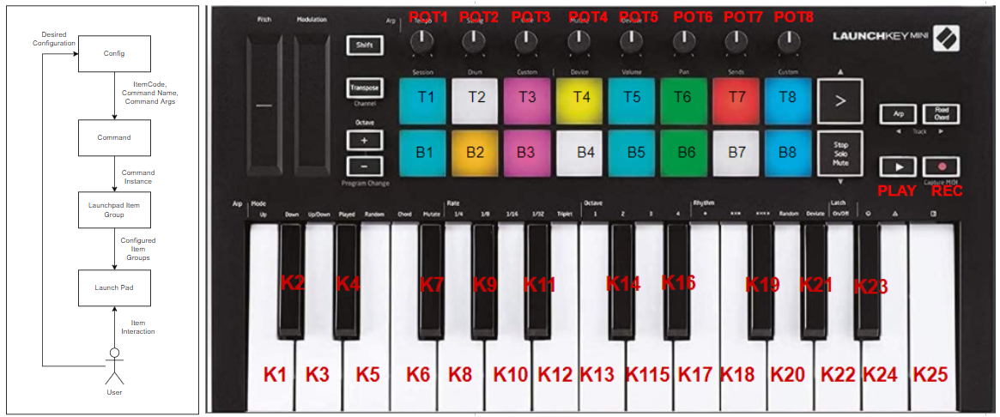

# Launchpad

Run custom commands using a Launchkey Mini MK3 MIDI



## Installation

```bash
git clone https://github.com/GjergjiSh/launchkey-deck.git
pip install -r requirements.txt
```

## Configuration

The bindings between the keys and the commands are defined in the [config](./config.yml) file.  
Parameters for each command are also defined in the [config](./config.yml) file.  
The file is structured as follows:

```yaml
pads:
  # Key code of the pad
  - code: 36
    # Name of the CommandClass
    command_name: "OpenFolderCommand" 
    # Name of the Command Module from the commands collection
    command_module: "folders" 
    # Arguments for the command (Number of arguments depends on the command)
    folder_path: "C:/Users/Gjergji/Desktop"

potentiometers:
  ...

play_rec:
  ...
  
keys:
  ...

```

## Key Codes

### PadCodes
- T1 = 40
- T2 = 41
- T3 = 42
- T4 = 43
- T5 = 48
- T6 = 49
- T7 = 50
- T8 = 51
- B1 = 36
- B2 = 37
- B3 = 38
- B4 = 39
- B5 = 44
- B6 = 45
- B7 = 46
- B8 = 47


### PotentiometerCodes
- POT1 = 21
- POT2 = 22
- POT3 = 23
- POT4 = 24
- POT5 = 25
- POT6 = 26
- POT7 = 27
- POT8 = 28


### PlayRecCodes 
- PLAY = 115 
- REC = 117


### KeyCodes
- K1 = 48
- K2 = 49
- K3 = 50
- K4 = 51
- K5 = 52
- K6 = 54
- K7 = 55
- K8 = 56
- K9 = 57
- K10 = 58
- K11 = 59
- K12 = 60
- K13 = 61
- K14 = 62
- K15 = 63
- K16 = 64
- K17 = 65
- K18 = 66
- K19 = 67
- K20 = 68
- K21 = 69
- K22 = 70
- K23 = 71
- K24 = 72
- K25 = 73

## Run

To run, make sure to configure the [config](./config.yml) file and then run:

```bash
    pythonw main.pyw
```

## Add new commands

To add new commands, create a new file in the [commands collection](./launchpad/commands/collection) folder and
extend the config file with the new command.